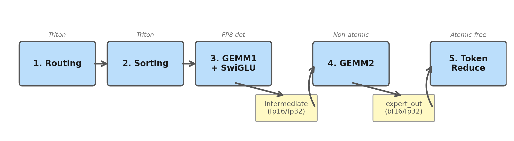
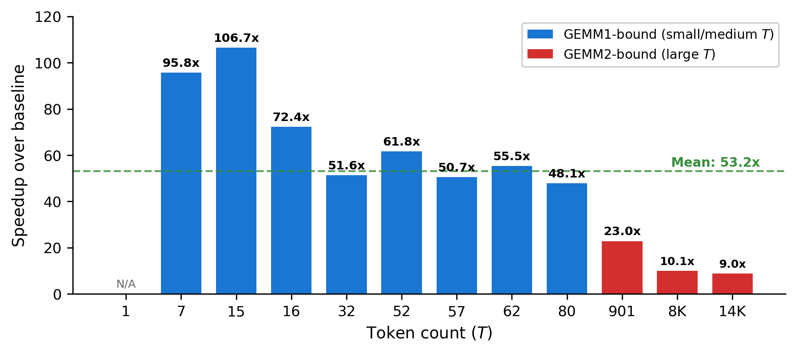
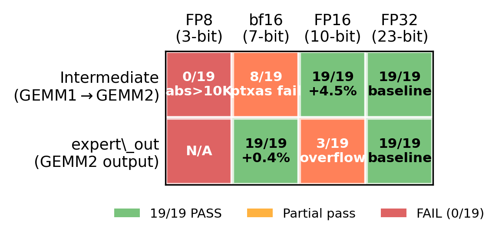
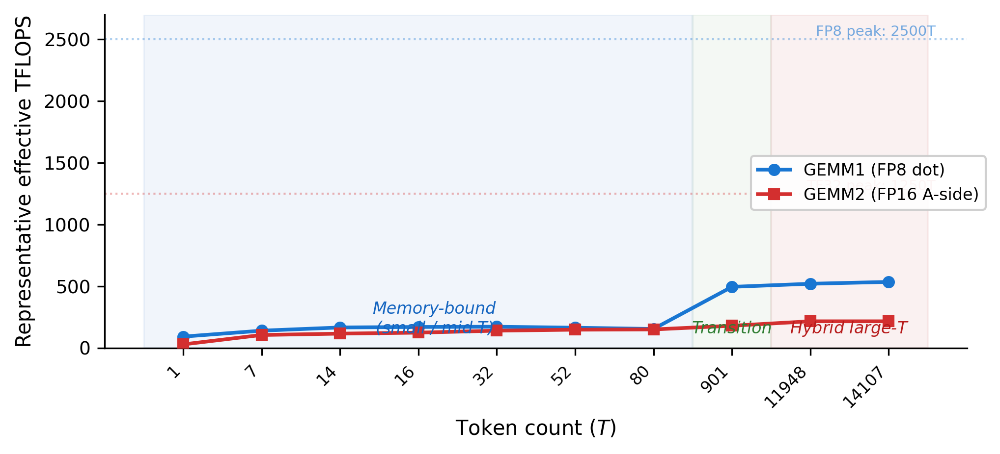
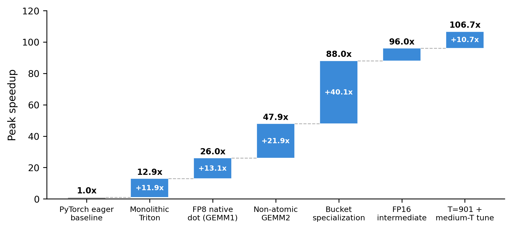
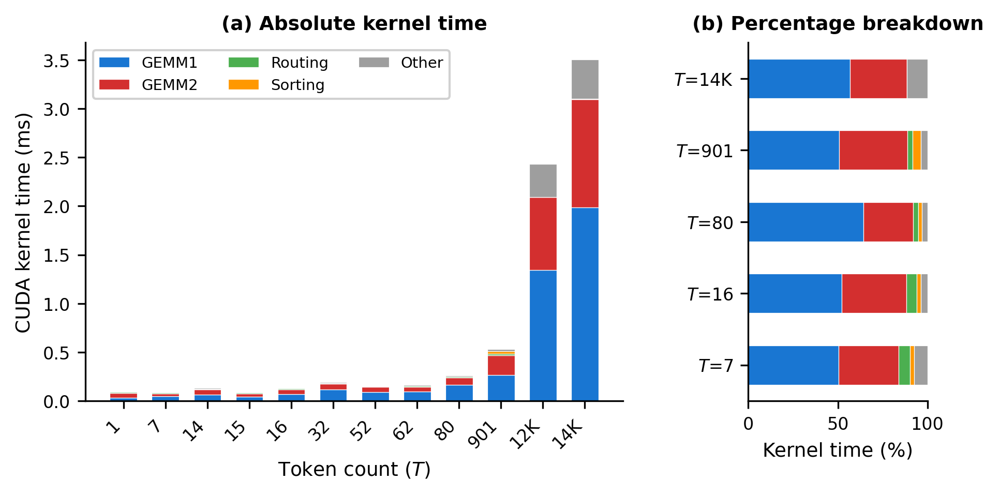

# Fused MoE Kernel Optimize

> **Fused MoE Inference Kernel — Hybrid Triton + CuTe DSL for DeepSeek-V3 Expert Dispatch on NVIDIA B200 Blackwell**

[](#key-results)
[-76b900)](https://www.nvidia.com/en-us/data-center/b200/)
[](https://github.com/triton-lang/triton)
[](https://github.com/NVIDIA/cutlass)
[](#key-results)
[](README_CN.md)

A hybrid **[Triton](https://github.com/triton-lang/triton) + [CuTe DSL](https://github.com/NVIDIA/cutlass)** implementation of the DeepSeek-V3 Mixture-of-Experts (MoE) inference kernel, targeting **NVIDIA B200 (Blackwell, sm_100a)**. Developed for **Track A** of the [MLSys 2026 FlashInfer-Bench Challenge](https://github.com/flashinfer-ai/flashinfer-bench).

- **Triton** powers 17/19 workloads (routing, sorting, GEMM1+SwiGLU, GEMM2, token reduce)
- **CuTe DSL** (NVIDIA CUTLASS) handles 2/19 large-T workloads (T=11948, T=14107) via grouped GEMM with per-T isolated runtimes

**19/19 workloads passed** | Peak ~56x | Large-T ~13–15x | Mean ~54x (session-dependent)

> **Note on absolute speedup numbers:** Modal B200 shared instances have no clock-locking; the same code can fluctuate 20–30% across sessions. Official evaluation runs on bare-metal B200 with locked clocks (`nvidia-smi -ac 3996,1965`). Numbers here are for relative trend reference only.

---

## Table of Contents

- [Key Results](#key-results)
- [Architecture](#architecture)
- [Quick Start](#quick-start)
- [Project Structure](#project-structure)
- [Evaluation Environment](#evaluation-environment)
- [Optimization Journey](#optimization-journey)
- [Paper](#paper)
- [Constraints](#constraints)

---

## Key Results

| Metric | Value |
|--------|-------|
| Correctness | **19/19 PASSED** |
| Peak Speedup | ~56x (Modal B200, session-dependent) |
| Large-T Speedup (T=8192–14107) | ~13–15x |
| Mean Speedup | ~54x |
| Scoring Method | CUPTI GPU kernel time only (CPU overhead excluded) |

---

## Architecture

The kernel implements a **6-stage fused pipeline** with a hybrid Triton + CuTe DSL backend:

```
Input → Routing → Token Sorting → GEMM1+SwiGLU → GEMM2 → Token Reduce → Output
```

| Stage | Description | Key Technique |
|-------|-------------|---------------|
| 1. **Routing** | DeepSeek-V3 no-aux: sigmoid → group-filter → top-8 → normalize | Pure Triton kernel |
| 2. **Token Sorting** | Tile-parallel histogram + offset, BLOCK_M-aligned padding | Parallel sort & scatter |
| 3. **GEMM1 + SwiGLU** | Fused W1/W3 with shared A-side loads | **FP8 native tensor core dot** (2x throughput) |
| 4. **GEMM2** | Non-atomic write to expert_out buffer | Post-dot B-scale, bf16 expert_out |
| 5. **Token Reduce** | Per-token program reads TOP_K=8 expert contributions | Zero-atomic, zero-copy |
| 6. **T=1 Path** | Single-token decode specialization | Fused routing+sort+GEMM |

### Runtime Dispatch Strategy

The entry point (`kernel.py`) automatically dispatches based on token count T:

| Condition | Path | BLOCK_M | Kernel |
|-----------|------|---------|--------|
| T=11948 | CuTe DSL grouped GEMM | 128 | Per-T isolated CuTe runtime |
| T=14107 | CuTe DSL grouped GEMM | 128 | Per-T isolated CuTe runtime |
| T=901 | Isolated Triton | 64 | Static launch cap, dedicated autotune |
| T=1 | Pure Triton | 16 | Fused single-token path |
| T=53–59 | Pure Triton | **8** | Tight BLOCK_M — reduces padding waste 4× |
| 32 ≤ T ≤ 64 | Pure Triton | 32 | `_small_medium_*` |
| 65 ≤ T ≤ 128 | Pure Triton | 32/64 | `_medium_*` |
| T > 128 | Pure Triton | 64 | `_fused_moe_*` (generic) |
| T > 2048 | Pure Triton | 128 | `_fused_moe_*` (generic) |
| T ≥ 4096 | Pure Triton | dynamic | Exact dispatch (`total_blocks.item()`) |

<details>
<summary><b>Profiling Bottleneck Breakdown</b> (NCU, B200, 19 real traces)</summary>

| T Range | GEMM1 % | GEMM2 % | Routing+Sort | Reduce | Bottleneck |
|---------|---------|---------|-------------|--------|------------|
| T=1 | 32% | **55%** | 10% | (fused) | GEMM2 |
| T=7–80 | **51–61%** | 32–37% | 5–10% | 2% | GEMM1 |
| T=901 (isolated) | **52.6%** | 35.3% | 7.9% | 2.3% | GEMM1 |
| T=11948–14107 | 40% | **49–50%** | 5–6% | 3% | GEMM2 |

> GEMM1 TFLOPS: 103–182T (small-T) / 485–535T (large-T). GEMM2 TFLOPS: 82–150T (small-T) / 216T (large-T).

</details>

### Three-Way Dispatch Architecture

```
kernel.py (entry)
  ├── T in {11948, 14107}  →  triton_impl.py     →  CuTe DSL grouped GEMM
  │                            ├── cute_gemm1_mma.py + cute_gemm1_mma_runtime_{T}.py
  │                            ├── cute_gemm2_mma.py + cute_gemm2_mma_runtime_{T}.py
  │                            └── cute_grouped_gemm_sm100.py
  ├── T == 901             →  triton_impl_t901.py →  Isolated Triton (static launch cap)
  └── Other T              →  pure_triton_impl.py →  Pure Triton kernels
```

> **Per-T Isolation:** Each specialized T value has its own runtime file, sharing no Python module state, compile cache, or metadata cache across paths.

---

## Quick Start

### Setup

```bash
# 1. Create conda environment
conda create -n fi-bench python=3.12
conda activate fi-bench

# 2. Install dependencies
pip install flashinfer-bench modal torch triton numpy

# 3. Clone contest dataset
git lfs install
git clone https://huggingface.co/datasets/flashinfer-ai/mlsys26-contest

# 4. Modal login (one-time)
modal setup
```

### Run Benchmark

```bash
# Upload data to Modal volume (one-time)
modal volume create flashinfer-trace
modal volume put flashinfer-trace /path/to/mlsys26-contest /

# Pack & run
python scripts/pack_solution_simple.py
python -m modal run scripts/test_modal.py
```

### A/B Testing (Recommended)

```bash
# Save baseline
python scripts/pack_solution_simple.py
cp solution.json solution_a.json

# Make changes, then save experiment
python scripts/pack_solution_simple.py
cp solution.json solution_b.json

# A/B comparison on same B200 session
python -m modal run scripts/ab_test_modal.py
```

> **Decision criteria:** Mean speedup delta > 2% is signal; ≤2% is noise. Large-T delta > 1% is reliable.

---

## Project Structure

```
mlsys_note/
├── solution/
│   └── python/                              # Submission directory (config.toml: language=python)
│       ├── kernel.py                        # Entry: 3-way dispatch (CuTe / T=901 / Pure Triton)
│       ├── pure_triton_impl.py              # Pure Triton main impl (16/19 workloads)
│       ├── triton_impl.py                   # Hybrid CuTe+Triton impl (large-T workloads)
│       ├── triton_impl_t901.py              # T=901 isolated Triton path (static launch cap)
│       ├── cute_gemm1_mma.py                # CuTe DSL GEMM1 core logic
│       ├── cute_gemm1_mma_runtime_{T}.py    # Per-T isolated GEMM1 runtimes
│       ├── cute_gemm2_mma.py                # CuTe DSL GEMM2 core logic
│       ├── cute_gemm2_mma_runtime_{T}.py    # Per-T isolated GEMM2 runtimes
│       └── cute_grouped_gemm_sm100.py       # CuTe DSL grouped GEMM core (NVIDIA ref)
├── scripts/
│   ├── ab_test_modal.py                     # A/B comparison (same B200 session) ★ recommended
│   ├── test_modal.py                        # Modal B200 single benchmark
│   ├── run_modal.py                         # Modal full benchmark (with auto-pack)
│   ├── run_local.py                         # Local benchmark (requires B200)
│   ├── profile_modal.py                     # Modal torch.profiler profiling
│   ├── ncu_profile_modal.py                 # Modal NCU per-kernel time breakdown
│   ├── pack_solution_simple.py              # Pack solution.json
│   └── ...
├── paper.tex                                # Technical paper (LaTeX)
├── paper.pdf                                # Compiled paper
├── config.toml                              # Config (team name, track, entry_point)
├── solution.json                            # Packed submission file
└── mlsys26-contest/                         # Contest dataset (submodule)
```

---

## Evaluation Environment

| Item | Value |
|------|-------|
| Docker Image | `flashinfer/flashinfer-ci-cu132:20260401-2c675fb` |
| PyTorch | `2.12.0.dev20260331+cu132` |
| Triton | 3.6.0 |
| CuTe DSL | nvidia-cutlass-dsl (CUTLASS) |
| GPU | B200 (bare-metal, sm_100a) |
| Tolerance | `--atol 1 --rtol 0.3 --required-matched-ratio 0.9` |
| Scoring | Sum of CUPTI GPU kernel times (CPU overhead excluded) |

---

## Optimization Journey

<details>
<summary><b>Phase 1: Foundation (0x → 12.9x)</b></summary>

| Stage | Description | Peak |
|-------|-------------|------|
| Initial | PyTorch eager per-expert loop | ~1x |
| torch.compile | Fused dequant+GEMM+SwiGLU | ~5x |
| Monolithic Triton | Eliminated per-expert launches | ~12.9x |

</details>

<details>
<summary><b>Phase 2: Core Triton Optimizations (12.9x → 46x)</b></summary>

| Commit | Optimization | Impact |
|--------|-------------|--------|
| `496da33` | Triton autotune + GEMM2 BLOCK_K=128 | ~5x → 8x |
| `3d3aace` | Hybrid token sort + K-loop pointer hoisting | Structural improvement |
| `c1943ae` | Routing gather-first + pre-alloc buffers | Reduced CPU overhead |
| `99c1b13` | **FP8 Native Tensor Core** (`tl.dot(fp8,fp8)`) | **2x FLOP throughput** |
| `786ee59` | GEMM2 post-dot B-scale | Eliminated [BK,BN] dequant |
| — | Token-Centric Reduce (zero-atomic, zero-copy) | Small-T +46–78% |
| — | Parallel Sort (GPU tile-parallel histogram) | Broke single-thread bottleneck |

</details>

<details>
<summary><b>Phase 3: Bucket Specialization (46x → 55x+)</b></summary>

| Commit | Optimization | Impact |
|--------|-------------|--------|
| `0b865b3` | T=1 dedicated kernel path | Eliminated decode overhead |
| `c59e09d` | 3-phase (T>4096) | Large-T latency **−20%** |
| `d2fdf14` | **Medium-T bucket** (4-level BLOCK_M) | Multi-workload latency **−20~54%** |
| `c685b02` | Exact dispatch for large-T | Large-T latency **−5%** |
| `93e3a84` | Disabled Triton LSR + asymmetric L2 eviction | Mean **+4.9%** |
| `93e3a84` | Deep pipeline GEMM2 (num_stages=6–8) | Mean +2.1% |
| `f49c5ab` | 2D Tiled Token Reduce | Large-T **+2.9%** |
| `9d5a2f8` | Medium-T Column-Major dispatch | Medium-T up to **+8.9%** |
| `a5256cc` | **FP16 Intermediate Buffer** (×0.125/×8.0 scale) | AB-test mean **+4.5%**, 13/19 improved |

</details>

<details>
<summary><b>Phase 4: Precision & Bandwidth Exploration</b></summary>

| Experiment | Result | Conclusion |
|------------|--------|------------|
| bf16 Intermediate | 10/19 PASSED | SwiGLU dynamic range too large; 7-bit mantissa insufficient |
| fp16 Intermediate (global) | T=7 matched_ratio=0.0 | SwiGLU extremes exceed fp16 max (65504) |
| **fp16 Intermediate (T≥32)** | **19/19, +4.5%** | ×0.125 scale + ×8.0 compensation; T<32 fp32 fallback |
| **bf16 expert_out (T≥32)** | **19/19, +0.4%** | bf16 range=3.4e38, no overflow; saves 50% write bandwidth |
| fp16 expert_out | 3/19 overflow | Values exceed fp16 max → inf |
| GEMM2 FP8 (all variants) | 0–5/19 | 3-bit mantissa cascading error; **sealed** |

**Conclusion:** Intermediate precision ladder: fp16 > bf16 > fp8 (only fp16+scaling viable). expert_out: bf16 > fp16 > fp8 (only bf16 viable). GEMM2 A-side must stay ≥fp16.

</details>

<details>
<summary><b>Phase 5: Contest Rule-Aware Optimization (Round 10)</b></summary>

**Key rule updates (Apr 14–15 organizer clarification):**
- **100x tolerance relaxation**: Official `atol=1.0, rtol=0.3, ratio=0.9` (we tested at `atol=0.01`)
- **CUPTI GPU-only timing**: CPU overhead, launch latency, `.item()` syncs all excluded from scoring
- **Self-contained requirement**: cuBLAS/CUTLASS/FlashInfer runtime calls discouraged; organizers "value seeing the team's own implementation"

| Commit | Optimization | Result |
|--------|-------------|--------|
| `c1effcc` | **bf16 expert_out (T≥32)** | 19/19 PASSED, AB-test mean +0.4%, large-T +2.5% |
| `c1effcc` | **CUBLAS_ENABLED=False** | Strategy: disable cuBLAS to reduce review risk |

</details>

<details>
<summary><b>Phase 6: Per-T Isolation & Final Tuning (Rounds 19–22)</b></summary>

| Commit | Optimization | Result |
|--------|-------------|--------|
| `f088f03` | **Per-T Isolated CuTe Runtime** | AB-test mean +1.4%, **T=14107 +55.1%** (13.19x → 20.45x) |
| `03e746f` | **T=901 Isolated Triton Path** | AB-test **+6%** (static launch cap avoids host sync) |
| `886c7fc` | CuTe precision investigation | T=14107 restored to CuTe after isolation fix |
| `2e134c7` | **Tight BLOCK_M=8 for T=53–59** | AB-test **+3.8% mean**, 7/19 improved (up to +14.5%), 0 regressed |

</details>

<details>
<summary><b>Full Commit Audit</b> — confidence ratings for all optimizations</summary>

All kernel.py optimization commits are classified into four confidence levels:

| Rating | Meaning |
|--------|---------|
| ✅✅ **Confirmed Real** | Multi-workload latency improvement >20%, or entirely new kernel path |
| ✅ **Likely Real** | Mean latency improvement 5–20%, or large-T improvement >5% |
| ⚠️ **Uncertain** | Improvement <5%, within noise range |
| ❌ **Confirmed Regression** | Measured regression or reverted |

| Commit | Description | Rating | Rationale |
|--------|-------------|--------|-----------|
| Early arch (`aa7c1b1`→`effc2f2`) | From zero to 12.9x | ✅✅ | Ground-up implementation |
| `496da33` | Triton autotune + BLOCK_K=128 | ✅✅ | Peak 5x → 8x |
| `3d3aace` | Hybrid sort + pointer hoist | ✅✅ | Algorithmic structure change |
| `99c1b13` | FP8 native tensor core | ✅✅ | 2x FLOP throughput |
| `c1943ae` | Routing gather-first | ✅ | CPU overhead reduction |
| `786ee59` | GEMM2 post-dot B-scale | ✅ | Compute order change |
| `0b865b3` | T=1 dedicated kernel (+481 lines) | ✅✅ | Entire new path |
| `c59e09d` | 3-phase (T>4096) | ✅✅ | Latency −20% |
| `d2fdf14` | Medium-T bucket | ✅✅ | Latency −20~54% |
| `c685b02` | Exact dispatch (large-T) | ✅ | Latency −5% |
| `93e3a84` | Disabled Triton LSR + L2 eviction | ✅✅ | Peak/mean significant (+4.9%) |
| `93e3a84` | Deep pipeline GEMM2 | ✅ | Mean +2.1% |
| `f49c5ab` | 2D Tiled Token Reduce | ✅ | Large-T +2.5~2.9% |
| `9d5a2f8` | Medium-T Column-Major | ✅ | Medium-T up to +8.9% |
| `c19336d` | Fused Routing+Histogram | ✅ | Large-T routing/sort −1.5% |
| `67ef373` | T=901 GEMM2 Dedicated Kernel | ✅ | Single kernel −3% |
| `1010fb4` | Small/Medium-T GEMM1 Autotune | ✅✅ | GEMM1 latency −1.6~6.6% |
| `c35907d` | T=1 GEMM1/2 Autotune | ✅✅ | Latency −3% |
| `a5256cc` | **FP16 Intermediate Buffer** | ✅✅ | AB-test mean +4.5%, 13/19 improved |
| `f040d09` | **T=901 Static Launch Cap** | ✅✅ | AB-test +6% |
| `f088f03` | **Per-T Isolated CuTe Runtime** | ✅✅ | T=14107 +55.1% |
| `c1effcc` | **bf16 expert_out** | ✅ | Mean +0.4%, large-T +2.5% |
| `2e134c7` | **Tight BLOCK_M=8 (T=53–59)** | ✅✅ | AB-test +3.8% mean, 7/19 improved, 0 regressed |

**Conclusion: All active optimizations in the current mainline are rated ✅ or ✅✅.**

</details>

<details>
<summary><b>Failed Optimizations & Dead Ends</b> — what we tried and why it didn't work</summary>

### Precision Hard Limits

| Attempt | Result | Reason |
|---------|--------|--------|
| bf16 Intermediate | 10/19 PASSED | 7-bit mantissa too coarse for SwiGLU range |
| fp16 Intermediate (global) | T=7 ratio=0.0 | Extremes exceed fp16 max (65504) |
| fp16 expert_out | 3/19 overflow | Values exceed fp16 max → inf |
| GEMM2 FP8 (all variants) | 0–5/19 | 3-bit mantissa cascading error |
| MXFP8 `tl.dot_scaled` | ratio 0.17–0.32 | e8m0 shared exponent too coarse |

### Architectural Failures

| Attempt | Result | Reason |
|---------|--------|--------|
| Persistent GEMM2 | 52x → 15.6x | Lost tensor-level parallelism |
| TMA Accelerator | −1~2% | HBM bandwidth already saturated by LDG |
| 1D Atomic Scatter | 8.3x → 5.37x | Scalar atomic storm crashed memory controller |
| Fused GEMM2+Reduce (atomic_add) | −4.5~4.8% | 12 bytes/elem atomic vs 2 bytes bf16 store |
| CUDA Graph for GEMMs | No benefit | CUPTI scores GPU kernel time only |
| torch.compile on routing | No benefit | CPU overhead excluded from scoring |
| Warp Specialization | Crashes / −34% | Needs TMA block pointers to benefit |
| `tl.make_tensor_descriptor` (TMA) | −4% | Descriptor setup cost not amortized for K=2048 |
| `num_ctas=2` without TMA | No benefit | Both CTAs compute identical tile |

### Autotune Saturation (confirmed Apr 2026)

All three kernels (GEMM1, GEMM2, token_reduce) have fully saturated autotune spaces. Further config search yields ≤0.4% (noise). Improvement requires algorithmic/architectural changes.

</details>

---

## Paper

<details>
<summary><b>Read the full technical paper</b></summary>

**Title:** *Fused MoE Inference on Blackwell: A Pure Triton Approach to DeepSeek-V3 Expert Dispatch*

**Authors:** Jiayao Zhang, Jiaoliang Yu

> **Note:** The paper title references "Pure Triton" as the core approach. The final submission evolved into a hybrid Triton + CuTe DSL architecture, where CuTe DSL handles 2 large-T workloads for additional performance.

**Abstract:**
We present a hybrid Triton + CuTe DSL implementation of the DeepSeek-V3 MoE kernel targeting the NVIDIA B200 (Blackwell, sm_100a) GPU. Our 6-stage pipeline exploits FP8 native tensor core dot products for 2x throughput in GEMM1, a non-atomic two-pass GEMM2-then-reduce architecture, FP16 intermediate buffers with scale-and-cast compensation, and multi-level bucket specialization across four BLOCK_M tiers. On 19 real-trace workloads (T=1 to T=14,107), the system achieves 19/19 correctness and a peak speedup of 106.65x (mean 55.77x) over the naive per-expert baseline, as measured by CUPTI GPU-only kernel timing.

**Key contributions:**
1. 6-stage fused pipeline (Triton + CuTe DSL) eliminating per-expert launches
2. Native FP8 tensor core dot in GEMM1 — 2x throughput over TF32
3. Non-atomic GEMM2 with token-centric reduce — +46% on medium-T
4. FP16 intermediate buffers with ×0.125/×8.0 compensation — −50% bandwidth
5. Five BLOCK_M tiers (8/16/32/64/128) with workload-aware dispatch
6. Per-T isolated CuTe DSL runtimes for large-T grouped GEMM (+55% on T=14107)

The compiled paper is available at [`paper.pdf`](paper.pdf). Source: [`paper.tex`](paper.tex).

**Poster:** [`poster.pdf`](poster.pdf) (A0 landscape, 4-column layout) | Source: [`poster.tex`](poster.tex)

### Figures

| | |
|:---:|:---:|
|  |  |
| Pipeline Architecture | Speedup by Workload |
|  |  |
| Precision Exploration Matrix | TFLOPS Efficiency |
|  |  |
| Optimization Timeline | Kernel Time Breakdown |

</details>

---

## Constraints

| Constraint | Description |
|------------|-------------|
| API Style | Destination-passing: `kernel(*inputs, *outputs)`, output is the last argument |
| **Tolerance** | **`atol=1.0, rtol=0.3, matched_ratio=0.9`** — an element only fails if abs>1 AND rel>0.3 |
| Scoring | Sum of CUPTI GPU kernel times; CPU overhead excluded |
| Docker | `flashinfer/flashinfer-ci-cu132:20260401-2c675fb` (pinned) |
| GPU Arch | sm_100a — must explicitly specify `-arch=sm_100a` in build flags |
| cuBLAS/CUTLASS | Not hard-banned; organizers "value seeing team's own implementation" |
| FlashInfer Runtime | Not allowed to call FlashInfer API at runtime; may copy source into repo |
| Self-contained | All code must reside in `solution/python/`, packed into solution.json |
| Memory | 32 experts × ~56MB FP8 = ~1.8GB; B200 has ~180GB — not a bottleneck |

---

## Modal B200 Noise Analysis

<details>
<summary><b>Measurement noise characterization</b></summary>

Measured via back-to-back self-comparison on the **same Modal B200 session** (`ab_test_modal.py`):

| Metric | Noise Range | Notes |
|--------|------------|-------|
| **Mean speedup** | **±2%** | Very stable; reliable for overall comparison |
| **Individual small/medium-T** | **±15%** | Same code yielded 55.52x and 64.68x (Δ=16.5%) |
| **Large-T (≥4096)** | **<1%** | Δ=0.1–0.2%, near-zero noise |

**Criteria for confirming optimization effectiveness:**
- Mean speedup delta > 2% (exceeds noise floor)
- Or large-T latency delta > 1%
- Individual workload variation ≤15% is **not** actionable

> **Cross-session drift:** The same code can show 20–30% speedup difference across different Modal B200 sessions on different days. This is entirely due to shared-instance clock/load state, not code regression.

</details>

---

## Notes

1. **Evaluation environment is unified:** All Modal scripts use the official Docker image, PyTorch 2.12.0+cu132, Triton 3.6.0, CuTe DSL (CUTLASS), Python 3.12. Local (Windows) is for packing and code review only.

2. **Three-way dispatch paths are independent:** Each can be iterated separately via `kernel.py`'s T-based routing. Per-T isolation ensures no shared state pollution.

3. **Confirmed dead ends (do not retry):**
   - ~~bf16 Intermediate~~ — 7-bit mantissa insufficient (10/19)
   - ~~FP8 GEMM2~~ — 3-bit mantissa sealed (0–5/19)
   - ~~fp16 expert_out~~ — overflow >65504
   - ~~Persistent GEMM2~~ — lost parallelism (52x → 15.6x)
   - ~~TMA Accelerator~~ — HBM saturated by LDG
   - ~~Expert skipping~~ — top-8 weights too large to skip safely
   - ~~All autotune sweeps~~ — saturated

4. **Resolved historical issues:**
   - ~~T=14107 CuTe precision bug~~ → Fixed via per-T isolated runtime (`f088f03`); T=14107 restored to CuTe path (20.45x vs Pure Triton 13.19x)
